# Kafka MirrorMaker 2 Data Replication 

## Architecture 




## 📁 Folder Structure
```
Kafka-Data-Replication/
│
├── producer/                        # Java producer service
│   ├── Dockerfile
│   └── src/
│       └── main/
│           └── java/
│               └── KafkaProducer.java   # Sends JSON commit-log events
│
├── README.md                        # Project documentation
├── docker-compose.yml               # Service configuration
├── mm2.properties                   # MirrorMaker 2 configuration
├── reset.json                       # Reset configuration file
└── run_challenge.sh                 # Automation script
```
---
## Repository Links

| Resource | URL |
|---|---|
| Kafka Fork | https://github.com/TirumalaSrividya/kafka |
| Pull Request | https://github.com/TirumalaSrividya/kafka/pull/6

---

## Docker Hub Images

| Image | Tag | Description |
|---|---|---|
| `srividyatirumala/custom-mm2` | `latest` | MirrorMaker 2 with data-loss and topic-reset detection |
| `srividyatirumala/kafka-producer` | `latest` | Java producer that sends JSON commit-log events |

---

## Setup Instructions

### Prerequisites

- Docker ≥ 24
- Docker Compose v2 (or v1 with `docker-compose`)

### Start the stack

```bash
# Clone the repo
git clone https://github.com/TirumalaSrividya/Kafka-Data-Replication
cd Kafka-Data-Replication

# Start everything (Kafka clusters + MM2 + producer)
docker compose up -d
```

MirrorMaker 2 is configured via `mm2.properties` in the project root. It replicates the `commit-log` topic from `primary-kafka:9092` → `standby-kafka:9094` and exposes its admin listener on port `8083`.

---

## Test Execution

Run the full challenge script

 **Linux / Mac / Git Bash / WSL :**

```bash
chmod +x run_challenge.sh
./run_challenge.sh
```

**Windows Command Prompt / PowerShell :**

```powershell
bash run_challenge.sh
```


**Scenario 1 — Normal Replication**


**Scenario 2 — Log Truncation / Data Loss Detection**


**Scenario 3 — Topic Reset Recovery**


---

## Unit Test Execution - Core Functionality

The core detection logic is covered by unit tests that run without Docker or a live Kafka broker.

### Prerequisites

- Java 17+
- Run from inside the Kafka fork directory

```bash
cd kafka-fork
```

**Git Bash / Linux / Mac:**
```bash
./gradlew :connect:mirror:test --tests "org.apache.kafka.connect.mirror.MirrorSourceTaskTest"
```

**Windows CMD:**
```cmd
gradlew :connect:mirror:test --tests "org.apache.kafka.connect.mirror.MirrorSourceTaskTest"
```
---

## Log Analysis

### Useful commands

```bash
# Live MM2 logs
docker logs -f mm2

# Last 60 lines
docker logs mm2 2>&1 | tail -60

# Check replication on standby
docker exec standby-kafka \
  /opt/kafka/bin/kafka-run-class.sh kafka.tools.GetOffsetShell \
  --bootstrap-server standby-kafka:9094 \
  --topic primary.commit-log --time -1

# Check earliest available offset on primary
docker exec primary-kafka \
  /opt/kafka/bin/kafka-run-class.sh kafka.tools.GetOffsetShell \
  --bootstrap-server primary-kafka:9092 \
  --topic commit-log --time -2
```

### Key log messages to monitor

- `MM2 successfully assigned commit-log for replication` 
- `DATA LOSS DETECTED`
- `TOPIC RESET DETECTED`

---

## Design Rationale

The implementation strategy was designed to extend Kafka MirrorMaker 2 with additional reliability checks for failure scenarios that are commonly seen in distributed data replication systems.

MirrorMaker 2 was chosen as the base implementation because it already provides stable and scalable cross-cluster replication. Instead of building a custom replication system from scratch, the project focuses on enhancing MM2’s replication behavior with additional fault-detection and recovery capabilities.

An expected-offset tracking approach was implemented using an in-memory `expectedOffsets` map inside `MirrorSourceTask`. This strategy was chosen because offset progression is the most reliable way to identify replication anomalies during polling. By comparing incoming offsets with expected offsets, the system can detect:
- Forward jumps in offsets → treated as log truncation or data loss
- Backward jumps in offsets → treated as topic deletion and recreation (topic reset)

A fail-fast strategy was intentionally used for data-loss detection. When the broker’s earliest available offset becomes greater than the expected offset, the task immediately throws a `DataLossException` instead of silently continuing replication. This approach was chosen to prevent unnoticed message loss and make replication failures explicit.

For topic reset scenarios, an automatic recovery strategy was implemented instead of failing the task. When offsets restart from zero after topic recreation, the consumer automatically seeks to the beginning and resumes replication. This decision was made because topic recreation is considered a recoverable operational scenario unlike irreversible data loss.

Special handling was added for compacted topics because Kafka log compaction naturally creates offset gaps. Without this logic, valid compaction behavior could be incorrectly detected as data loss. Compact topics are therefore excluded from strict gap validation.

The implementation also performs startup validation using `beginningOffsets()` before replication begins. This strategy was chosen to detect already-truncated data immediately during task initialization rather than waiting for failures during runtime polling.

Comprehensive unit tests were added for normal replication, offset synchronization, log truncation, topic reset recovery, compacted topic handling, and `OffsetOutOfRange` conditions. The testing strategy focuses on validating both successful replication behavior and failure handling paths to improve reliability and regression safety.

A fully automated Bash execution script was created to reproduce all replication scenarios consistently. The script performs:
- Kafka cluster startup
- Topic creation
- MirrorMaker initialization
- Controlled log truncation simulation
- Topic reset simulation
- Validation of MM2 recovery behavior

This automation strategy was chosen to make the scenarios reproducible without requiring manual Kafka operations and to simplify evaluation of the challenge workflow.

Overall, the implementation prioritizes reliability, fault detection, controlled recovery behavior, and reproducible testing while keeping the architecture modular and close to real-world Kafka replication workflows.

---

## AI Usage Documentation

- Helped troubleshoot inter-container networking issues in docker-compose.yml and mm2.properties configuration.
- Clarified retry loop patterns and sleep timings while writing run_challenge.sh.
- Explained why MM2 misses topics created after startup, which led to adding the pre-creation step.
- Helped think through the offset comparison logic for data loss and topic reset detection.
